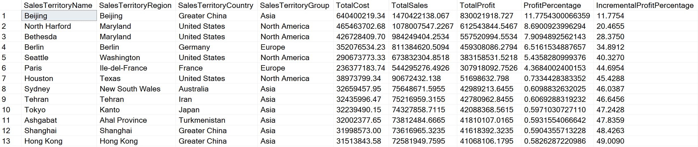
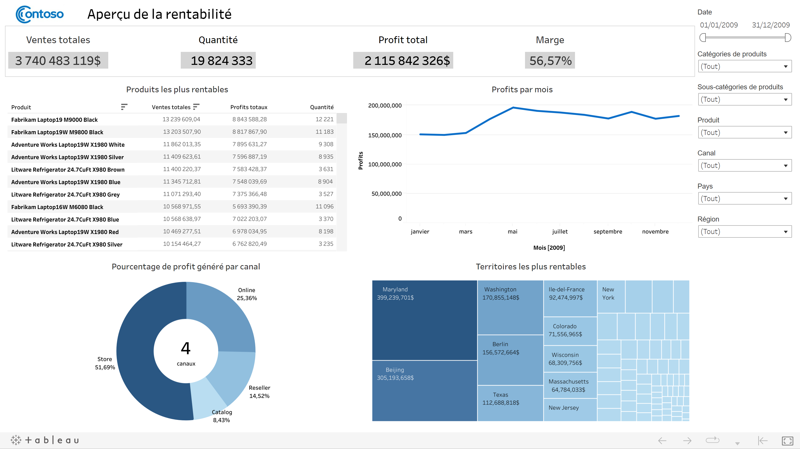
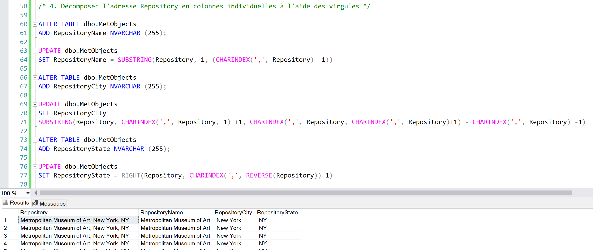

&nbsp;
## [Projet 1 : Data mining](https://github.com/Keven-Luu/Portfolio-projects/blob/main/Data%20mining%20project%20with%20SQL%20(part%201).sql)
* Outils utilisés : SQL, CTE, Fonctions d’agrégation, Fonctions Windows, Jointures, Variables, Vues.

* Créer des requêtes permettant d'identifier : Les produits les plus rentables par unité; Les profits totaux réalisés par l'entreprise fictive; Les produits les plus rentables en général et leur importance relative en termes de profit; Les canaux les plus rentables et leur importance relative; Les villes les plus rentables et leur importance relative :

&nbsp;
## [Projet 2 : Data visualization](https://public.tableau.com/app/profile/keven.luu/viz/Contoso2009Tableaudebordinteractif/Contoso2009Tableaudebordinteractif)
* Outils utilisés : Tableau, SQL, Excel, Actions, Filtres.

* Créer un tableau de bord interactif montrant un aperçu de la rentabilité de Contoso (entreprise fictive) pour l'année 2019.

&nbsp;
## [Projet 3 : Data cleaning](https://github.com/kevenluu/Portfolio-projects/blob/main/Data%20cleaning%20project%20with%20SQL%20(part%203).sql)
* Outils utilisés : SQL, CTE, Excel, Fonctions d'agrégation, Fonction Windows

* Créer des requêtes permettant de : Standardiser les formats de date; Imputer la moyenne des valeurs cohérentes aux valeurs incohérentes; Remplacer les valeurs NULL ou manquantes; Supprimer les colonnes désuettes; Supprimer les duplications présumées; Décomposer une colonne en colonnes individuelles à l'aide de délimiteurs :

